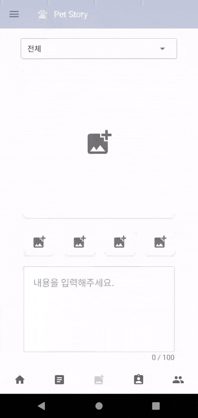
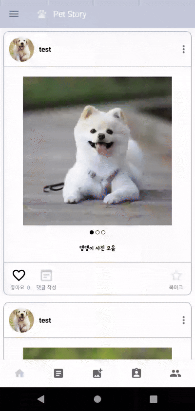
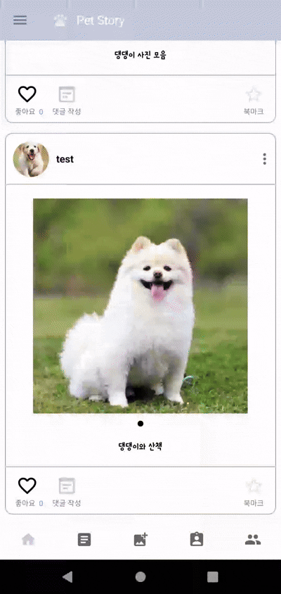

# Pet Story  
반려동물의 사진과 일상을 기록하고 다른 유저들과 공유할 수 있는 반려동물 전용 SNS 앱입니다.

## 주요 기능

### 1. 메인 타임라인
- 내가 쓴 글과 친구가 쓴 글을 전체 타임라인에서 확인
- 북마크 기능으로 원하는 게시글을 스크랩
- 글 내용 공유 가능

### 2. 서브 타임라인
- 친구 추가 기능
- 전체 사용자들의 최신 글 목록 제공

### 3. 새 글 작성
- 최대 100자까지 자유롭게 텍스트 작성
- 최대 5장의 이미지 첨부 가능
- 애완동물 태그 선택 후 게시 가능

### 4. 내 정보
- 애완동물 프로필 등록 및 수정
- 태그별 게시글 필터링
- 사용자 정보 수정
  
### 5. 친구 목록
- 친구 목록 확인 및 친구 삭제, 차단 가능
- 친구와의 채팅 목록 제공
  
## 기술 스택  
- Java  
- Android SDK  
- Firebase  
  - Realtime Database (채팅 기능)  
  - Cloud Firestore (일반 데이터 저장)  
  - Cloud Messaging (푸시 알림)  
  - Dynamic Links (딥링크)  
- Bottom Navigation  
- Navigation Drawer
  
## 프로젝트 구조

com.example.petstory  
├── activity      # 주요 화면(Activity) 클래스들  
├── adapter       # RecyclerView 등에서 사용하는 어댑터  
├── fragment      # UI 단위로 나뉜 프래그먼트  
├── model         # 데이터 모델 클래스  
├── util          # 유틸성 클래스  
├── view          # 커스텀 뷰 클래스  
  
  
## DB 구조
   
  
  
## 실제 동작 화면

| 화면 | 설명 |
| ---- | ---- |
|  | **회원가입 → 로그인** 회원가입을 완료 후 로그인 진행 |  
|  | **게시물 작성** 게시글을 작성하고 업로드 진행 |  
|  | **유저 간 채팅** 앱 사용자들끼리 실시간으로 채팅을 주고받는 화면입니다. |  
|  | **푸시 알림 수신** 서버에서 발송한 푸시 알림을 단말에서 수신 |  
|  | **딥링크 이동** 외부 링크를 통해 앱이 실행되고 특정 화면으로 바로 진입 |

  
## 화면 캡쳐

<table>
  <tr>
    <td></td>
    <td></td>
  </tr>
</table>
<table>
  <tr>
    <td></td>
    <td></td>
  </tr>
</table>

<table>
  <tr>
    <td></td>
    <td></td>
  </tr>
</table>  

## 개발자  

- GitHub: [daengjun](https://github.com/daengjun)
- Email: jundroidx@gmail.com
